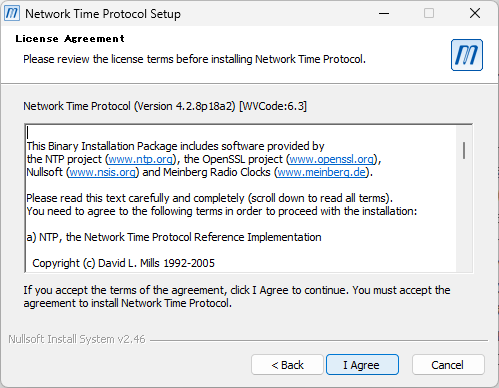
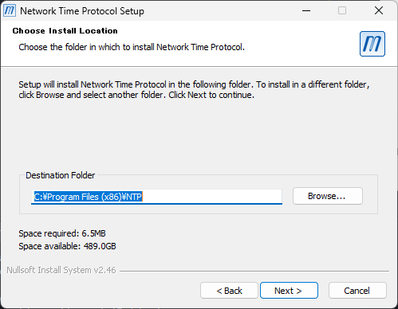
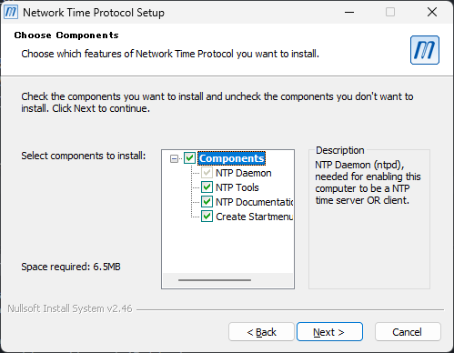
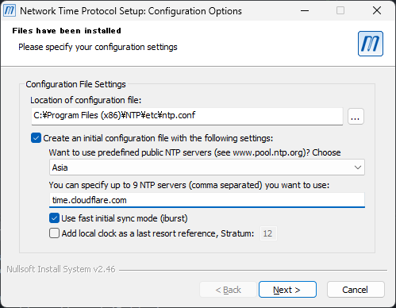
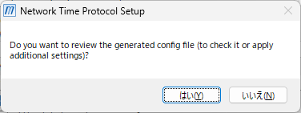
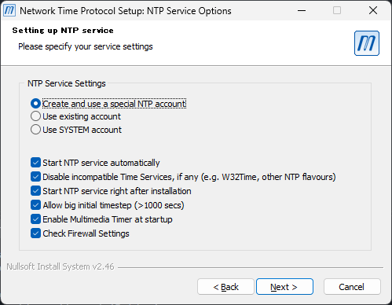
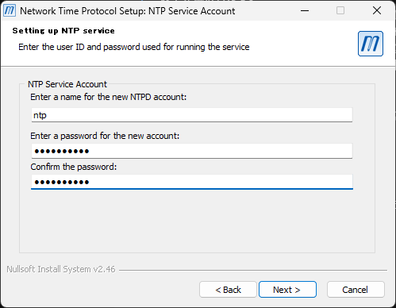
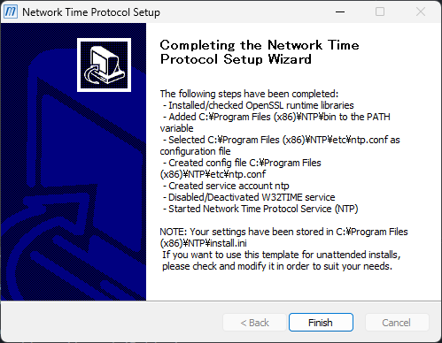

# 高精度な時計の表示

メイン画面の時計はコンピューターの内蔵時刻を表示しますが、Windows環境ではmacOSやLinuxと比較して1秒〜30秒程度の時刻誤差（ズレ）が発生することがあります。

このドキュメントでは、時刻精度を向上させるための2つの設定方法を解説します。

- **1. W32TIME (Windows標準機能)**：追加ソフト不要。レジストリ調整で精度向上を図る方法
- **2. Meinberg NTP ソフトウェア**：専用ソフトを導入し、より高い精度と安定性を実現する方法

---

## 1. W32TIME (Windowsデフォルト) の設定変更

標準サービスの同期頻度と応答性を高める手順です。

1. トリガー起動の設定

    コマンドプロンプトを**管理者として起動**し、以下のコマンドを実行します。

    ```cmd
    sc triggerinfo w32time start/networkon stop/networkoff
    ```

2. NTPサーバーの変更

    レジストリエディターを起動し、以下のキーを開きます。

    ```text
    HKEY_LOCAL_MACHINE\SYSTEM\CurrentControlSet\Services\W32Time\Parameters
    ```

    `NtpServer`の値を以下に置き換えます。

    ```text
    time.cloudflare.com,0x8 time.windows.com,0x8
    ```

3. 同期パラメータの調整

    レジストリエディターで以下のキーを開きます。

    ```text
    HKEY_LOCAL_MACHINE\SYSTEM\CurrentControlSet\Services\W32Time\Config
    ```

    各値を以下のように更新します。

    - `UpdateInterval`: `0x64` (1秒)
    - `PhaseCorrectRate`: `7`

4. 設定の反映

    ```text
    net stop w32time
    net start w32time
    ```

5. 設定の確認

    ```text
    w32tm /query /status
    ```

    time.cloudflare.comという表示があれば設定が反映されています。

> **参考: 公式ドキュメント**
> 設定内容の詳細については以下を参照してください。
> [Windows タイム サービスのツールと設定 | Microsoft Learn](https://learn.microsoft.com/ja-jp/windows-server/networking/windows-time-service/windows-time-service-tools-and-settings?tabs=parameters)

## Meinberg NTP ソフトウェアによる対応

サードパーティ製の専用NTPクライアントを導入し、高精度な時刻同期を行います。

### 準備

下記のページからインストーラをダウンロード

<https://www.meinbergglobal.com/english/sw/ntp.htm> (English)

インストール中の設定に関する詳細な解説は以下のサイトに存在する。

<https://www.meinbergglobal.com/english/sw/readme-ntpinstaller.htm> (English)

これ以降は上記の手順から推奨する手順でのインストール方法を紹介する。

### インストール

1. ダウンロードしたインストーラを起動

    ライセンス等が表示されるので、同意します。
    

2. インストール先を選択

    NTPソフトウェア等を配置する場所を選択します。
    特に特殊な要件がない限り、デフォルトのままを推奨します。
    

3. インストールするコンポーネントを選択

    最低限 `NTP Daemon` を選択してください。
    特に特殊な要件がない限り、デフォルトのままを推奨します。
    

    `Next` を押すとソフトウェアのインストールが始まります。

4. NTPソフトウェアの設定

    インストールが完了すると初期設定を作成する画面が表示されます。
    以下が必須の設定になります。

    - `Create an initial configuration file with the following settings` にチェックをいれる
    - `Want to use predefined public NTP servers (see www.pool.ntp.org)? Choose` を`Asia`を選択する
    - `You can specify up to 9 NTP servers (comma separated) you want to use:` に `time.cloudflare.com` を入力する

    

5. 設定ファイルの確認

    `Do you want to review the generated config file (to check it or apply additional settings)?`
    という確認ダイアログが表示されます。

    設定ファイルを編集したりする必要があるなら`はい`、そうでないなら`いいえ`をクリックします。

    

6. NTPサービスの設定

    `Create and use a special NTP account` を選択します。

    下のチェックボックスはデフォルトの状態を推奨します。

    

    適当な5文字以上のパスワードを設定します。
    使用しているときに入力することはありませんが、どこかに記録しておくことをおすすめします。

    

    以下の画面になったらインストール完了です。
    `Finish` を押してインストーラを終了します。

    

    これでMeinberg NTP ソフトウェアのインストールと設定が完了します。
    インストール以降は自動で時刻同期が行われます。
