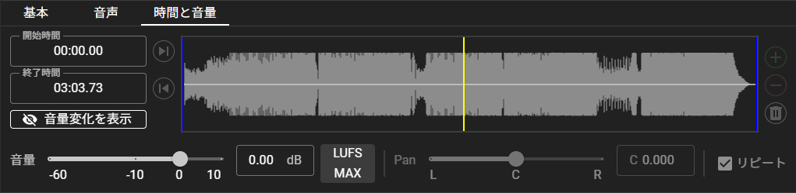
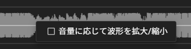

# 音声キュー

音声キューを使用すると、正確な再生範囲、音量、リピート、フェードイン、フェードアウトを設定し、様々なフォーマットの音声ファイルを再生することができます。

再生先のデバイスはPCに設定されている既定のデバイスになります。

## 再生可能なファイル

音声ファイルフォーマットとしては以下のものをサポートしています。

- AAC - Advanced Audio Coding (.aac, .mp4, .m4a等)
- AIFF - Audio Interchange File Format (.aiff, .aif, .aifc)
- ALAC - Apple Lossless Audio Codec (.alac, .mp4, .m4a等)
- CAF - Core Audio Format (.caf)
- FLAC - Free Lossless Audio Codec (.flac)
- MKV - Matroska Media Container (.mkv, .mka)
- MP3 - MPEG-1 Audio Layer-3 (.mp3)
- MP4 - MPEG-4 Part 14 (.mp4, .m4a)
- OGG - OGG Container Format (.ogg, .ogx, .oga)
- WAV - RIFF waveform Audio Format (.wav)
- WebM - WebM Container Format (.webm)

ここに記載されているファイル以外にも再生可能であるフォーマットが存在している可能性もあります。
いくつかの特殊な形式を持ったファイルは再生できないことがあります。

::: warning 注意
オーディオファイルに付与されたタグ情報（トラック番号、トラック名、アルバム、ReplayGain等）は完全に無視されます。
:::

### 制限事項

SBS Playerでは、ステレオおよびモノラルの音源のみをサポートしています。
2chよりも多いチャンネル数を持つファイルを再生することはできませんので、あらかじめ2chになるように編集してご使用ください。

## 音声キューのエディター項目

音声キューは全キュー共通の"基本"タブの他に、"音声"タブおよび"時間と音量"タブを持っています。

### "音声"タブ

- **対象ファイル**

    再生対象のファイルパスです。

    > プロジェクトモードの場合は相対パスで表記されます。

- **実行時にすべてのファイルをロードする**

    オンになっている場合、実行開始時にファイルのすべてをロードし、再生を開始します。
    そのため、実行時に僅かな遅延が発生します。
    オフになっている場合、実行中に徐々にファイルから音声データをロードします。

    オンの場合は音声が即座に再生されないことがあるため、特に問題がない場合、オフにすることが推奨されます。

::: info
事前にロードコマンドでロードし、実行する場合はオンにすることが推奨されます。
また、再生時に途切れる場合、オンにすることで解決する場合があります。
:::

- **フェードイン**

    実行時に音声をフェードインするための設定です。
    実行時のみで再生が再開されたときには適用されません。

    おすすめのカーブ種別はEaseOutです。

- **フェードアウト**

    停止時に音声をフェードアウトするための設定です。
    ユーザーが停止処理を行ったときにのみ適用され、一時停止および音声が最後まで到達したときには適用されません。

    おすすめのカーブ種別はEaseInです。

### "時間と音量"タブ

- **開始時間 / 終了時間**

    音声ファイルのうち、実際に再生を開始する時間、再生を終了する時間を指定できます。

    先頭・末尾のノイズのカットなどに使用できます。

    また、一番右の<svg xmlns="http://www.w3.org/2000/svg" viewBox="0 0 24 24" width="20" height="20"><title>skip-next</title><path d="M16,18H18V6H16M6,18L14.5,12L6,6V18Z" fill="white" /></svg>ボタン及び<svg xmlns="http://www.w3.org/2000/svg" viewBox="0 0 24 24" width="20" height="20"><title>skip-previous</title><path d="M6,18V6H8V18H6M9.5,12L18,6V18L9.5,12Z" fill="white" /></svg>ボタンをクリックすることで、先頭と末尾の無音時間をスキップすることができます。

- **波形表示**

    音声の波形を表示します。
    左の青い線が開始時間、右の青い線が終了時間を示しています。
    カーソルを合わせると、カーソルが指している部分の音声内の時間が表示されます。

    また、実行中は黄色の線によって再生されている箇所が表示され、波形内の任意の位置をクリックすることで再生位置をクリックした位置に変更することができます。

    右クリックすることで音量フェーダーの値に応じて波形の大きさを変化させるかを設定できます。

    

- **音量フェーダー**

    音声ファイルの元の音量に対して変化させる音量を設定します。

    ファイルごとの音量差の調整等に使用できます。
    他のパラメーターと異なり、再生中にも変更することができます。
    フェーダーをダブルクリックすることで 0dB に合わせることができます。

    また、以下のボタンを使用することで、
    - **LUFS**: 音量フェーダーを目標LUFS（デフォルトでは-14LUFS）に合うように設定します。目標LUFSは設定において変更できます。
    - **MAX**: 音量フェーダーを最大振幅が0dBFSになるように設定します。（=クリップしない最大音量に設定する）

- **PANフェーダー**

    音声ファイルを再生する際のLRチャンネルの割合を設定します。
    「ステレオをモノラルにミックスダウン」の設定が有効の場合は機能しません。
    フェーダーをダブルクリックすることで C (中央) に合わせることができます。

- **リピート設定**

    音声再生のリピート設定です。
    音声が終了時間まで到達したときに再び開始時間から再生を開始するかどうかを設定できます。

