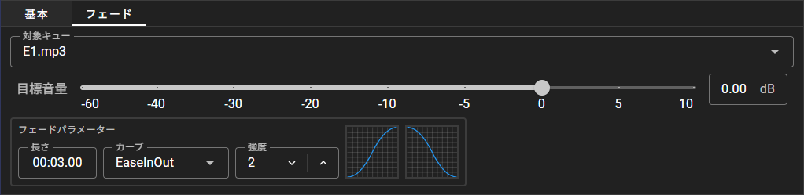

# フェードキュー

フェードキューは音声キューを対象として、その音量を変化させることができるキューです。

## フェードキューのエディター項目

- **対象キュー**

    フェードする対象のキューを設定します。
    対象としては音声キューおよびグループキューのみが選択できます。

    グループキューを対象としたときはそのグループに含まれるすべての実行中の音声キューが対象となります。

- **目標音量**

    フェードする目標音量を設定します。
    対象のキューの **音量** 項目には関係なく、その音量に対しての変化量として動作します。

    同じ音声キューに対して、複数のフェードキューで変更される音量値は共有されています。
    そのため、一度フェードキューによって減衰・増幅した音量を別のキューによって上書きすることができます。
    あとから 0dB を目標としたフェードキューを実行することでもとの音量に戻すことが可能です。

::: info
例えるならば、音声キューの **音量** 項目とフェードキューの **目標音量** が操作する値は、音響ミキサーのゲインとフェーダーの位置の関係に近いです。
フェードキューを実行する操作はフェーダーを指定したメモリまで変化させる操作に対応します。
:::

- **フェードパラメーター**

    音量をどのようにフェードさせるかを設定します。
    フェードにかける時間と、その時間内でどのように音量が変化するかを設定することができます。
    ２つのグラフの右側は音量が増加するときのカーブ、左側のグラフは音量が減少するときのカーブです。
