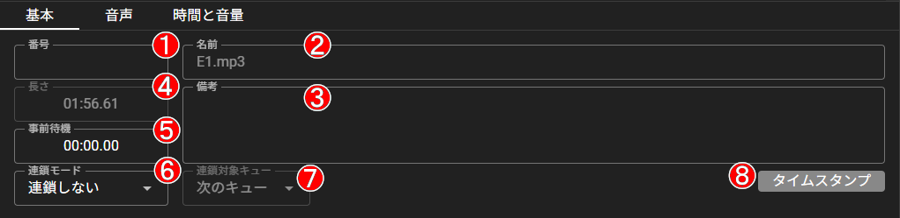

# 基本 エディタ

## 各項目の詳細

選択中のキューについて、情報や設定を変更することができます。
（選択中のキューであり、カーソルとは関係ありません。）

### <svg viewBox="0 0 26 26" width="25" height="25"><circle cx="13" cy="13" r="12" stroke="white" stroke-width="2px" fill="red" /><text x="13" y="21" text-anchor="middle" fill="white" font-size="16pt">1</text></svg> キュー番号

キューに設定される番号を編集します。

**再生される順序とは関係ありません。**
数値だけでなく、文字列も使用することができます。

### <svg viewBox="0 0 26 26" width="25" height="25"><circle cx="13" cy="13" r="12" stroke="white" stroke-width="2px" fill="red" /><text x="13" y="21" text-anchor="middle" fill="white" font-size="16pt">2</text></svg> キューの名前

キューに設定される名称を編集します。
空欄にすることで、キューの種類や設定に応じて自動的に名称が設定されます。

### <svg viewBox="0 0 26 26" width="25" height="25"><circle cx="13" cy="13" r="12" stroke="white" stroke-width="2px" fill="red" /><text x="13" y="21" text-anchor="middle" fill="white" font-size="16pt">3</text></svg> キューのノート

キューに設定されるノートを編集します。
上部ヘッダーに表示されるため、タイミング等の情報を記入できます。
[タイムスタンプ挿入ボタン](#8-ノートへのタイムスタンプ挿入ボタン)を利用することでキューのタイムスタンプを記録できます。

### <svg viewBox="0 0 26 26" width="25" height="25"><circle cx="13" cy="13" r="12" stroke="white" stroke-width="2px" fill="red" /><text x="13" y="21" text-anchor="middle" fill="white" font-size="16pt">4</text></svg> キューの長さ

音声キューの場合はファイルの音声の長さが表示され編集はできません。
待機キューの場合は待機時間を、フェードキューの場合はフェードにかける時間を編集することができます。

#### <svg viewBox="0 0 26 26" width="25" height="25"><circle cx="13" cy="13" r="12" stroke="white" stroke-width="2px" fill="red" /><text x="13" y="21" text-anchor="middle" fill="white" font-size="16pt">5</text></svg> キューの事前待機時間

キュー実行前の待機時間を編集できます。

#### <svg viewBox="0 0 26 26" width="25" height="25"><circle cx="13" cy="13" r="12" stroke="white" stroke-width="2px" fill="red" /><text x="13" y="21" text-anchor="middle" fill="white" font-size="16pt">6</text></svg> キューの連鎖モード

キューの連鎖モードを編集できます。

- **連鎖しない**：キュー終了後に何も行いません
- **開始後**：キュー開始後に対象のキューを実行します。
- **終了後**：キュー終了後に対象のキューを実行します。

#### <svg viewBox="0 0 26 26" width="25" height="25"><circle cx="13" cy="13" r="12" stroke="white" stroke-width="2px" fill="red" /><text x="13" y="21" text-anchor="middle" fill="white" font-size="16pt">7</text></svg> キュー連鎖の対象

キューの連鎖モードが設定されている時、連鎖する対象のキューを編集できます。
デフォルトではキューリストの次のキューが対象となっています。

#### <svg viewBox="0 0 26 26" width="25" height="25"><circle cx="13" cy="13" r="12" stroke="white" stroke-width="2px" fill="red" /><text x="13" y="21" text-anchor="middle" fill="white" font-size="16pt">8</text></svg> ノートへのタイムスタンプ挿入ボタン

キューが実行中の時、現在の経過時間をノートの挿入します。
タイミングをノートに記入する際に便利です。
