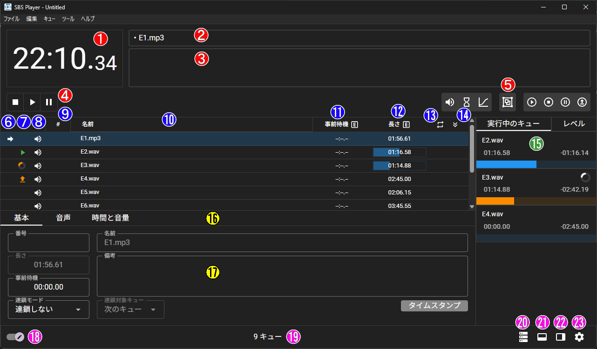

# メイン画面の説明

## 上部ヘッダー

### <svg viewBox="0 0 26 26" width="25" height="25"><circle cx="13" cy="13" r="12" stroke="white" stroke-width="2px" fill="red" /><text x="13" y="21" text-anchor="middle" fill="white" font-size="16pt">1</text></svg> 時計

コンピューターの時計を秒単位で表示します。
ソフトにフォーカスがない（ショートカットキーが効かない状態）にあると、赤い背景で表示されます。

### <svg viewBox="0 0 26 26" width="25" height="25"><circle cx="13" cy="13" r="12" stroke="white" stroke-width="2px" fill="red" /><text x="13" y="21" text-anchor="middle" fill="white" font-size="16pt">2</text></svg> カーソルのあるキューのタイトル

現在カーソルがあるキューのキュー番号と名前を"・"で繋げたものを表示します。
リモート操作時はカーソルがあるキューが表示されており、選択されているキューではないことに注意が必要です。

### <svg viewBox="0 0 26 26" width="25" height="25"><circle cx="13" cy="13" r="12" stroke="white" stroke-width="2px" fill="red" /><text x="13" y="21" text-anchor="middle" fill="white" font-size="16pt">3</text></svg> カーソルのあるキューのノート

現在カーソルがあるキューのノートを表示します。

### <svg viewBox="0 0 26 26" width="25" height="25"><circle cx="13" cy="13" r="12" stroke="white" stroke-width="2px" fill="red" /><text x="13" y="21" text-anchor="middle" fill="white" font-size="16pt">4</text></svg> カーソルのあるキューの操作

現在カーソルのあるキューについて、停止、実行、一時停止・再開・読み込みを制御できます。

### <svg viewBox="0 0 26 26" width="25" height="25"><circle cx="13" cy="13" r="12" stroke="white" stroke-width="2px" fill="red" /><text x="13" y="21" text-anchor="middle" fill="white" font-size="16pt">5</text></svg> 新規キューの追加ボタン

新たなキューを追加するボタンです。

左から

- 音声、待機、フェードキュー
- グループキュー
- 開始、停止、一時停止、読み込みキュー

です。

## キューリスト

### <svg viewBox="0 0 26 26" width="25" height="25"><circle cx="13" cy="13" r="12" stroke="white" stroke-width="2px" fill="blue" /><text x="13" y="21" text-anchor="middle" fill="white" font-size="16pt">6</text></svg> カーソル位置

現在のカーソルがあるキューの行に"➡"アイコンを表示します。
また、この列をクリックすることで、任意のキューにカーソルを設定できます。

### <svg viewBox="0 0 26 26" width="25" height="25"><circle cx="13" cy="13" r="12" stroke="white" stroke-width="2px" fill="blue" /><text x="13" y="21" text-anchor="middle" fill="white" font-size="16pt">7</text></svg> キューの実行状態

- <svg xmlns="http://www.w3.org/2000/svg" viewBox="0 0 24 24" width="20" height="20"><title>play</title><path d="M8,5.14V19.14L19,12.14L8,5.14Z" fill="#4CAF50" /></svg> 実行中
- <svg xmlns="http://www.w3.org/2000/svg" viewBox="0 0 24 24" width="20" height="20"><title>pause</title><path d="M14,19H18V5H14M6,19H10V5H6V19Z" fill="#FB8C00" /></svg> 一時停止
- <svg xmlns="http://www.w3.org/2000/svg" viewBox="0 0 53.333333333333336 53.333333333333336" style="transform: rotate(calc(-90deg));" width="20" height="20"><circle class="v-progress-circular__underlay" fill="transparent" cx="50%" cy="50%" r="20" stroke-width="13.333333333333334" stroke-dasharray="125.66370614359172" stroke-dashoffset="0"></circle><circle class="v-progress-circular__overlay" fill="transparent" cx="50%" cy="50%" r="20" stroke-width="13.333333333333334" stroke-dasharray="125.66370614359172" stroke-dashoffset="125.66370614359172px"></circle></svg> 停止中
- <svg xmlns="http://www.w3.org/2000/svg" viewBox="0 0 24 24" width="20" height="20"><title>upload</title><path d="M9,16V10H5L12,3L19,10H15V16H9M5,20V18H19V20H5Z" fill="#FB8C00" /></svg> 読み込み済み

### <svg viewBox="0 0 26 26" width="25" height="25"><circle cx="13" cy="13" r="12" stroke="white" stroke-width="2px" fill="blue" /><text x="13" y="21" text-anchor="middle" fill="white" font-size="16pt">8</text></svg> キューの種類

- <svg xmlns="http://www.w3.org/2000/svg" viewBox="0 0 24 24" width="20" height="20"><title>volume-high</title><path d="M14,3.23V5.29C16.89,6.15 19,8.83 19,12C19,15.17 16.89,17.84 14,18.7V20.77C18,19.86 21,16.28 21,12C21,7.72 18,4.14 14,3.23M16.5,12C16.5,10.23 15.5,8.71 14,7.97V16C15.5,15.29 16.5,13.76 16.5,12M3,9V15H7L12,20V4L7,9H3Z" fill="white" /></svg> 音声キュー
- <svg xmlns="http://www.w3.org/2000/svg" viewBox="0 0 24 24" width="20" height="20"><title>timer-sand-empty</title><path d="M6,2V8H6V8L10,12L6,16V16H6V22H18V16H18V16L14,12L18,8V8H18V2H6M16,16.5V20H8V16.5L12,12.5L16,16.5M12,11.5L8,7.5V4H16V7.5L12,11.5Z" fill="white" /></svg> 待機キュー
- <svg xmlns="http://www.w3.org/2000/svg" viewBox="0 0 24 24" width="20" height="20"><title>chart-bell-curve-cumulative</title><path d="M4 19V20H22V22H2V2H4V17C7 17 10 15 12.1 11.4C15.1 6.4 18.4 4 22 4V6C19.2 6 16.5 8.1 13.9 12.5C11.3 16.6 7.7 19 4 19Z" fill="white" /></svg> フェードキュー
- <svg xmlns="http://www.w3.org/2000/svg" viewBox="0 0 24 24" width="20" height="20"><title>group</title><path d="M1,1V5H2V19H1V23H5V22H19V23H23V19H22V5H23V1H19V2H5V1M5,4H19V5H20V19H19V20H5V19H4V5H5M6,6V14H9V18H18V9H14V6M8,8H12V12H8M14,11H16V16H11V14H14" fill="white" /></svg> グループキュー
- <svg xmlns="http://www.w3.org/2000/svg" viewBox="0 0 24 24" width="20" height="20"><title>play-circle-outline</title><path d="M12,20C7.59,20 4,16.41 4,12C4,7.59 7.59,4 12,4C16.41,4 20,7.59 20,12C20,16.41 16.41,20 12,20M12,2A10,10 0 0,0 2,12A10,10 0 0,0 12,22A10,10 0 0,0 22,12A10,10 0 0,0 12,2M10,16.5L16,12L10,7.5V16.5Z" fill="white" /></svg> 開始キュー
- <svg xmlns="http://www.w3.org/2000/svg" viewBox="0 0 24 24" width="20" height="20"><title>stop-circle-outline</title><path d="M12,2A10,10 0 0,0 2,12A10,10 0 0,0 12,22A10,10 0 0,0 22,12A10,10 0 0,0 12,2M12,4C16.41,4 20,7.59 20,12C20,16.41 16.41,20 12,20C7.59,20 4,16.41 4,12C4,7.59 7.59,4 12,4M9,9V15H15V9" fill="white" /></svg> 停止キュー
- <svg xmlns="http://www.w3.org/2000/svg" viewBox="0 0 24 24" width="20" height="20"><title>pause-circle-outline</title><path d="M13,16V8H15V16H13M9,16V8H11V16H9M12,2A10,10 0 0,1 22,12A10,10 0 0,1 12,22A10,10 0 0,1 2,12A10,10 0 0,1 12,2M12,4A8,8 0 0,0 4,12A8,8 0 0,0 12,20A8,8 0 0,0 20,12A8,8 0 0,0 12,4Z" fill="white" /></svg> 一時停止キュー
- <svg xmlns="http://www.w3.org/2000/svg" viewBox="0 0 24 24" width="20" height="20"><title>upload-circle-outline</title><path d="M8 17V15H16V17H8M16 10L12 6L8 10H10.5V14H13.5V10H16M12 2C17.5 2 22 6.5 22 12C22 17.5 17.5 22 12 22C6.5 22 2 17.5 2 12C2 6.5 6.5 2 12 2M12 4C7.58 4 4 7.58 4 12C4 16.42 7.58 20 12 20C16.42 20 20 16.42 20 12C20 7.58 16.42 4 12 4Z" fill="white" /></svg> 読み込みキュー

### <svg viewBox="0 0 26 26" width="25" height="25"><circle cx="13" cy="13" r="12" stroke="white" stroke-width="2px" fill="blue" /><text x="13" y="21" text-anchor="middle" fill="white" font-size="16pt">9</text></svg> キュー番号

キューに設定された番号を表示します。
**再生される順序とは関係ありません。**
キューエディタの基本タブや、編集モード時にダブルクリックすることで編集できます。
数値だけでなく、文字列も使用することができます。

### <svg viewBox="0 0 26 26" width="25" height="25"><circle cx="13" cy="13" r="12" stroke="white" stroke-width="2px" fill="blue" /><text x="13" y="20" text-anchor="middle" fill="white" font-size="14pt">10</text></svg> キューの名前

キューに設定された名称を表示します。
初期状態ではキューの種類に応じて適切なキュー名が自動で設定されます。
キューエディタの基本タブや、編集モード時にダブルクリックすることで編集できます。

### 時間表示部分

#### <svg viewBox="0 0 26 26" width="25" height="25"><circle cx="13" cy="13" r="12" stroke="white" stroke-width="2px" fill="blue" /><text x="13" y="20" text-anchor="middle" fill="white" font-size="14pt">11</text></svg> キューのPre-Wait

キューに設定されたPre-Waitを表示します。
Pre-Waitはキューが実行されるまでの待機時間を表します。詳細は　　　を参照してください。
キューエディタの基本タブや、編集モード時にダブルクリックすることで編集できます。

キューが実行前待機中である場合は待機の進捗が表示されます。

#### <svg viewBox="0 0 26 26" width="25" height="25"><circle cx="13" cy="13" r="12" stroke="white" stroke-width="2px" fill="blue" /><text x="13" y="20" text-anchor="middle" fill="white" font-size="14pt">12</text></svg> キューの所要時間

キューの種類に応じて実行にかかる時間を表示します。
キューエディタの基本タブや、編集モード時にダブルクリックすることで編集できます。

キューが実行中である場合は時間の進捗が表示されます。

#### <svg viewBox="0 0 26 26" width="25" height="25"><circle cx="13" cy="13" r="12" stroke="white" stroke-width="2px" fill="blue" /><text x="13" y="20" text-anchor="middle" fill="white" font-size="14pt">13</text></svg> キューのPost-Wait

キューに連鎖モードが設定されている場合、実行されてから連鎖がトリガーされるまでの時間を表示します。
キューエディタの基本タブや、編集モード時にダブルクリックすることで編集できます。

キューが実行中である場合は連鎖がトリガーされるまでの進捗が表示されます。

::: info NOTE
時間を表示する列のヘッダーにあるアイコンをクリックすることで以下の２つの表示モードを切り替えることができます。

- <svg xmlns="http://www.w3.org/2000/svg" viewBox="0 0 24 24" width="20" height="20"><title>alpha-e-box-outline</title><path d="M9,7H15V9H11V11H15V13H11V15H15V17H9V7M3,5A2,2 0 0,1 5,3H19A2,2 0 0,1 21,5V19A2,2 0 0,1 19,21H5C3.89,21 3,20.1 3,19V5M5,5V19H19V5H5Z" fill="white" /></svg> Elapsed：経過時間モード

- <svg xmlns="http://www.w3.org/2000/svg" viewBox="0 0 24 24" width="20" height="20"><title>alpha-r-box-outline</title><path d="M9,7H13A2,2 0 0,1 15,9V11C15,11.84 14.5,12.55 13.76,12.85L15,17H13L11.8,13H11V17H9V7M11,9V11H13V9H11M5,3H19A2,2 0 0,1 21,5V19A2,2 0 0,1 19,21H5A2,2 0 0,1 3,19V5A2,2 0 0,1 5,3M5,5V19H19V5H5Z" fill="white" /></svg> Remain：残り時間モード
:::

---

### <svg viewBox="0 0 26 26" width="25" height="25"><circle cx="13" cy="13" r="12" stroke="white" stroke-width="2px" fill="blue" /><text x="13" y="20" text-anchor="middle" fill="white" font-size="14pt">14</text></svg> キューのリピート設定

- 音声キューがリピート設定されている場合
- グループキューが"プレイリスト"モードに設定されており、リピート設定されている場合

にリピートアイコン（<svg xmlns="http://www.w3.org/2000/svg" viewBox="0 0 24 24" width="20" height="20"><title>repeat</title><path d="M17,17H7V14L3,18L7,22V19H19V13H17M7,7H17V10L21,6L17,2V5H5V11H7V7Z" fill="white" /></svg>）を表示します。

### <svg viewBox="0 0 26 26" width="25" height="25"><circle cx="13" cy="13" r="12" stroke="white" stroke-width="2px" fill="blue" /><text x="13" y="20" text-anchor="middle" fill="white" font-size="14pt">15</text></svg> キューの連鎖モード設定

連鎖モードが"自動継続"の場合は<svg xmlns="http://www.w3.org/2000/svg" viewBox="0 0 24 24" width="20" height="20"><title>arrow-down</title><path d="M11,4H13V16L18.5,10.5L19.92,11.92L12,19.84L4.08,11.92L5.5,10.5L11,16V4Z" fill="white" /></svg>
連鎖モードが"自動追従"の場合は<svg xmlns="http://www.w3.org/2000/svg" viewBox="0 0 24 24" width="20" height="20"><title>arrow-expand-down</title><path d="M22,4V2H2V4H11V18.17L5.5,12.67L4.08,14.08L12,22L19.92,14.08L18.5,12.67L13,18.17V4H22Z" fill="white" /></svg>
を表示します。

## サイドパネル

### <svg viewBox="0 0 26 26" width="25" height="25"><circle cx="13" cy="13" r="12" stroke="white" stroke-width="2px" fill="#349e33" /><text x="13" y="20" text-anchor="middle" fill="white" font-size="14pt">16</text></svg> 実行中のキュー

実行中のキューを表示します。
キューの番号、名前、経過時間、残り時間、再生中のリピート設定等が表示されます。

タブを切り替えることでレベルメーター表示に切り替えることができます。

## 下部エディタ

### "基本"タブ

選択中のキューについて、情報や設定を変更することができます。
（選択中のキューであり、カーソルとは関係ありません。）

#### <svg viewBox="0 0 26 26" width="25" height="25"><circle cx="13" cy="13" r="12" stroke="black" stroke-width="2px" fill="#fff800" /><text x="13" y="20" text-anchor="middle" fill="black" font-size="13pt">17</text></svg> キュー番号

キューに設定される番号を編集します。

**再生される順序とは関係ありません。**
数値だけでなく、文字列も使用することができます。

#### <svg viewBox="0 0 26 26" width="25" height="25"><circle cx="13" cy="13" r="12" stroke="black" stroke-width="2px" fill="#fff800" /><text x="13" y="20" text-anchor="middle" fill="black" font-size="13pt">18</text></svg> キューの名前

キューに設定される名称を編集します。
空欄にすることで、キューの種類や設定に応じて自動的に名称が設定されます。

#### <svg viewBox="0 0 26 26" width="25" height="25"><circle cx="13" cy="13" r="12" stroke="black" stroke-width="2px" fill="#fff800" /><text x="13" y="20" text-anchor="middle" fill="black" font-size="13pt">19</text></svg> キューのノート

キューに設定されるノートを編集します。
上部ヘッダーの[ノート部分](#3-カーソルのあるキューのノート)に表示されるため、タイミング等の情報を記入できます。
[タイムスタンプ挿入ボタン](#25-ノートへのタイムスタンプ挿入ボタン)を利用することでキューのタイムスタンプを記録できます。

#### <svg viewBox="0 0 26 26" width="25" height="25"><circle cx="13" cy="13" r="12" stroke="black" stroke-width="2px" fill="#fff800" /><text x="13" y="20" text-anchor="middle" fill="black" font-size="13pt">20</text></svg> キューの長さ

音声キューの場合はファイルの音声の長さが表示され編集はできません。
待機キューの場合は待機時間を、フェードキューの場合はフェードにかける時間を編集することができます。

#### <svg viewBox="0 0 26 26" width="25" height="25"><circle cx="13" cy="13" r="12" stroke="black" stroke-width="2px" fill="#fff800" /><text x="13" y="20" text-anchor="middle" fill="black" font-size="13pt">21</text></svg> キューのPre-Wait

キュー実行前の待機時間を編集できます。

#### <svg viewBox="0 0 26 26" width="25" height="25"><circle cx="13" cy="13" r="12" stroke="black" stroke-width="2px" fill="#fff800" /><text x="13" y="20" text-anchor="middle" fill="black" font-size="13pt">22</text></svg> キューの連鎖モード

キューの連鎖モードを編集できます。

- **連鎖しない**：キュー終了後に何も行いません
- **自動継続**：キュー開始後にPost-Wait分待機し、対象のキューを実行します。
- **自動追従**：キュー終了後に対象のキューを実行します。

#### <svg viewBox="0 0 26 26" width="25" height="25"><circle cx="13" cy="13" r="12" stroke="black" stroke-width="2px" fill="#fff800" /><text x="13" y="20" text-anchor="middle" fill="black" font-size="13pt">23</text></svg> キュー連鎖までの待機時間

キューの連鎖モードが"**自動継続**"の場合、キューの実行から対象のキューを実行するまでの時間を編集できます。
キューの連鎖モードが"**自動追従**"の場合、キューの長さが表示されます。

#### <svg viewBox="0 0 26 26" width="25" height="25"><circle cx="13" cy="13" r="12" stroke="black" stroke-width="2px" fill="#fff800" /><text x="13" y="20" text-anchor="middle" fill="black" font-size="13pt">24</text></svg> キュー連鎖の対象

キューの連鎖モードが設定されている時、連鎖する対象のキューを編集できます。
デフォルトではキューリストの次のキューが対象となっています。

#### <svg viewBox="0 0 26 26" width="25" height="25"><circle cx="13" cy="13" r="12" stroke="black" stroke-width="2px" fill="#fff800" /><text x="13" y="20" text-anchor="middle" fill="black" font-size="13pt">25</text></svg> ノートへのタイムスタンプ挿入ボタン

キューが実行中の時、現在の経過時間をノートの挿入します。
タイミングをノートに記入する際に便利です。

## フッター

### <svg viewBox="0 0 26 26" width="25" height="25"><circle cx="13" cy="13" r="12" stroke="white" stroke-width="2px" fill="#ff00e8" /><text x="13" y="20" text-anchor="middle" fill="white" font-size="13pt">26</text></svg> 編集・実行モードの切り替え

編集モードと実行モードを切り替える事ができます。

実行モードでは、[キュー追加ボタン](#5-新規キューの追加ボタン)、[下部エディタ](#下部エディタ)を非表示にします。
また、[キューリスト](#キューリスト)におけるダブルクリックの編集ができなくなります。

### <svg viewBox="0 0 26 26" width="25" height="25"><circle cx="13" cy="13" r="12" stroke="white" stroke-width="2px" fill="#ff00e8" /><text x="13" y="20" text-anchor="middle" fill="white" font-size="13pt">27</text></svg> キューの総数

リストに含まれるすべてのキューの数を表示します。
これはグループキュー内部のキューも含まれます。

### <svg viewBox="0 0 26 26" width="25" height="25"><circle cx="13" cy="13" r="12" stroke="white" stroke-width="2px" fill="#ff00e8" /><text x="13" y="20" text-anchor="middle" fill="white" font-size="13pt">28</text></svg> サーバーパネルを開く

リモート操作用のサーバー管理パネルを開きます。

### <svg viewBox="0 0 26 26" width="25" height="25"><circle cx="13" cy="13" r="12" stroke="white" stroke-width="2px" fill="#ff00e8" /><text x="13" y="20" text-anchor="middle" fill="white" font-size="13pt">29</text></svg> 下部エディタの表示切り替え

下部エディタの表示・非表示を切り替えます。

### <svg viewBox="0 0 26 26" width="25" height="25"><circle cx="13" cy="13" r="12" stroke="white" stroke-width="2px" fill="#ff00e8" /><text x="13" y="20" text-anchor="middle" fill="white" font-size="13pt">30</text></svg> サイドパネルの表示切り替え

サイドパネルの表示・非表示を切り替えます。

### <svg viewBox="0 0 26 26" width="25" height="25"><circle cx="13" cy="13" r="12" stroke="white" stroke-width="2px" fill="#ff00e8" /><text x="13" y="20" text-anchor="middle" fill="white" font-size="13pt">31</text></svg> 設定画面を開く

設定画面を開きます。

