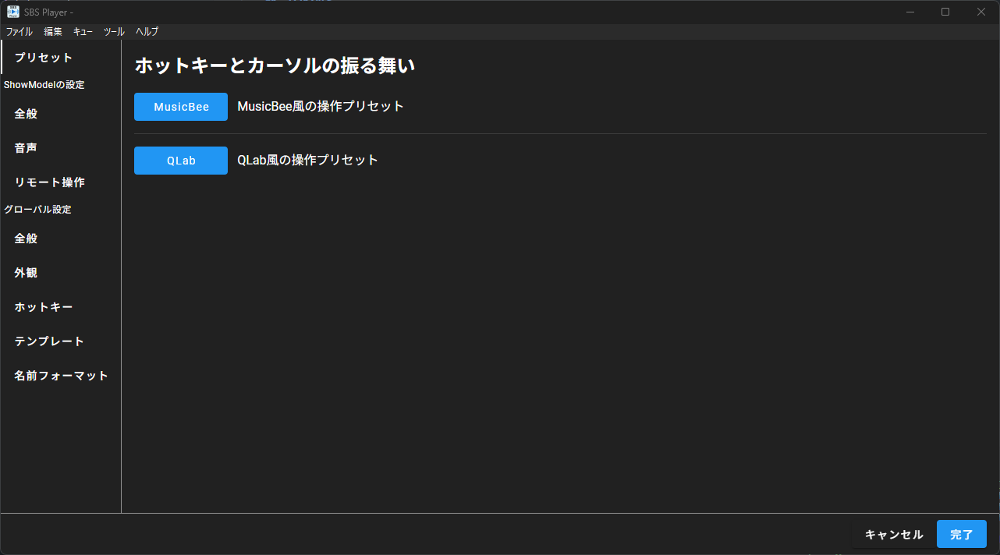
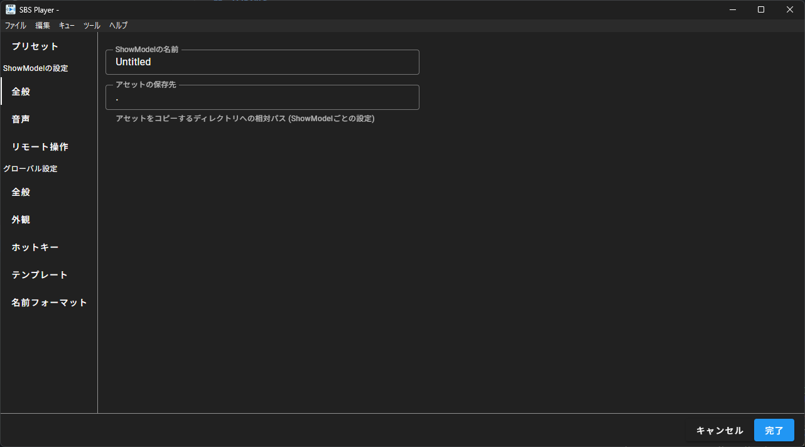
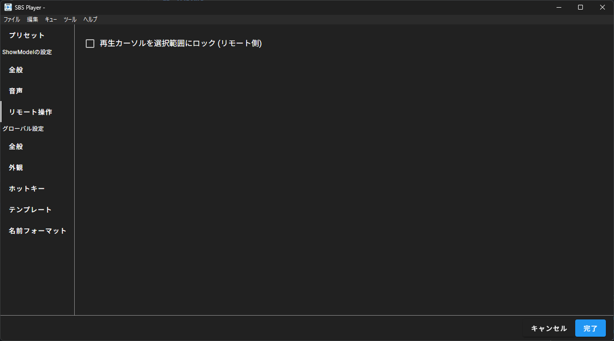
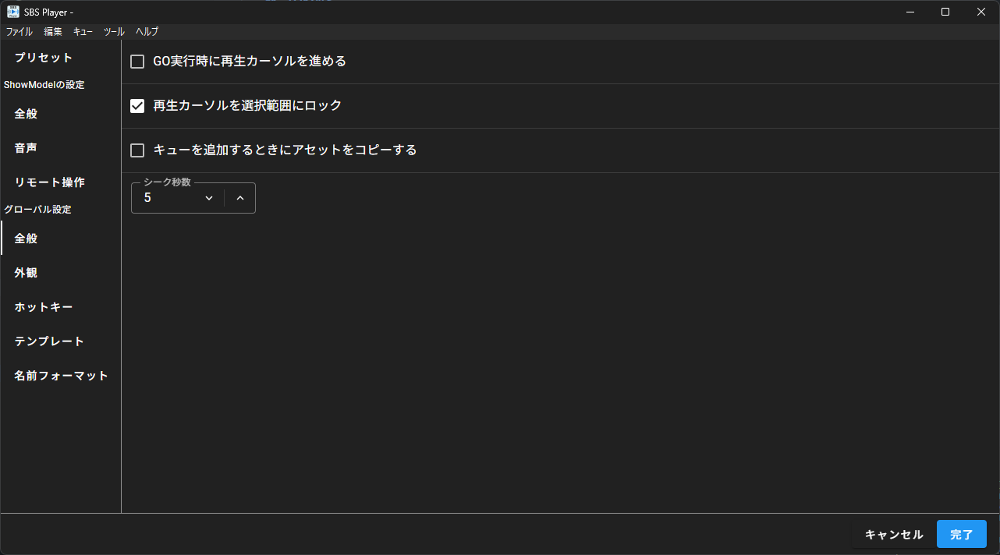
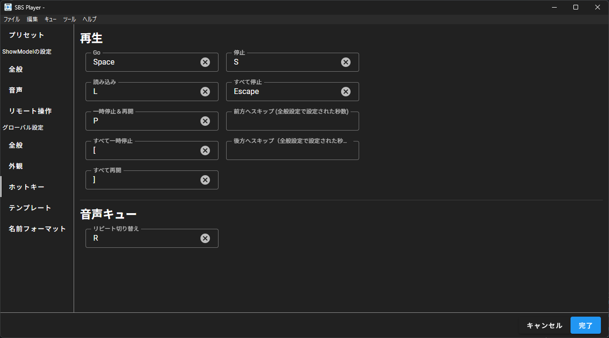

# 設定画面

ソフトウェアの動作や表示に関わる様々な設定項目を変更できます。

右下の完了ボタンを押すことで設定の変更を反映し、画面を閉じます。
キャンセルボタンを押すことで設定の変更を反映せずに画面を閉じます。

## プリセット

### ホットキーとカーソルの振る舞い

ホットキー設定やカーソルの動きを一括で設定することができます。

- **QLab**
    [QLab](https://qlab.app/)風のホットキー設定を行います。
    (GO: Space, 停止: S, すべて停止: Escape 等)
    また、キューの実行を行ったときに自動的に次のキューにカーソルを合わせます。

- MusicBee
    [MusicBee](https://getmusicbee.com/)の音源叩き用設定と同じホットキー設定を行います。
    (GO: Enter, 停止: Backspace, すべて停止: Escape 等)
    また、キューの実行を行ってもカーソル位置は変化しません。

## ShowModelの設定

### 全般

- **ShowModelの名前**
    ShowModel（プロジェクト）の名前を設定できます。

- **アセットの保存先**
    フォルダにエクスポートした際、音声ファイルなどのアセットを保存先のフォルダのどこに保存するかを指定できます。
    デフォルトでは保存先のフォルダと同じ位置(".")に保存されます。

### 音声

- **ステレオをモノラルにダウンミックス**
    ステレオの音声をモノラル（LRが同じ音）に変換します。

- **目標LUFS**
    音声の音量設定においてLUFSに合わせる際の目標LUFSを設定します。
    最終的に出力される音量がこのLUFSになるように音量が設定されます。

### リモート操作

- **再生カーソルを選択範囲にロック（リモート側）**
    リモート操作しているクライアントにおいて、選択範囲と再生カーソルをロックするかどうかを設定できます。

## グローバル設定

### 全般

- **GO実行時に再生カーソルを進める**
    キューを実行したときに、自動的に再生カーソルを進めるかどうかを設定します。

- **再生カーソルを選択範囲にロック**
    再生カーソルと選択範囲を同期するかどうかを設定できます。
    キュー実行時に実行されるキューは再生カーソルのあるキューです。
    この設定がOFFの場合は、手動で再生カーソルを設定する必要があります。

- **キューを追加するときにアセットをコピーする**
    フォルダにエクスポートされたプロジェクトを使用している際、新たに音声キューの対象ファイルを保存時にコピーするのではなく、キュー追加時に即座にコピーします。
    コピーしたファイルは自動的に削除されないため、このオプションの使用には注意が必要です。

- **シーク秒数**
    "前方へスキップ" や "後方へスキップ" を使用したときにスキップする秒数を設定できます。

### 外観

- **言語**
    UIの表示に使用する言語を設定できます。

- **ダークモード**
    UIの表示をダークモードで行うか、ライトモードで行うかを設定します。
    UIの表示はダークモード前提で設計しているため、ダークモードの使用が推奨されます。

- **上部ヘッダーの再生制御ボタンを隠す**
    再生制御ボタンの表示の有無を設定します。

    

### ホットキー

#### 再生ホットキー

- **GO**
    **再生カーソルのあるキュー**を実行します。

- **読み込み**
    **選択しているすべてのキュー**を読み込みます。

- **一時停止＆再開**
    **選択したキュー**を再生中の場合は一時停止、一時停止中の場合は再開します。
    動画共有サービスなどのSpaceキーと同じ動作です。

- **すべて一時停止**
    すべての実行中のキューを一時停止します。

- **すべて再開**
    すべての一時停止中のキューを再開します。

- **停止**
    **選択しているすべてのキュー**を停止します。

- **すべて停止**
    すべての実行中のキューを停止します。

- **前方へスキップ**
    **選択したキュー**の再生位置を一定秒数先へスキップします。
    スキップする秒数は[グローバル全般設定](#全般)で変更できます。

- **後方へスキップ**
    **選択したキュー**の再生位置を一定秒数前へスキップします。
    スキップする秒数は[グローバル全般設定](#全般)で変更できます。

#### 音声キューホットキー

- **リピート切り替え**
    **選択しているすべてのキュー**のリピート状態を切り替えます。
    このホットキーでは実行中のリピートの有無のみが変更され、キューのリピート設定は変更されません。

### テンプレート

キューの新規作成時のデフォルト設定を変更することができます。

### 名前フォーマット

キューの名前が設定されていないときに自動生成される名前のフォーマットを設定します。
